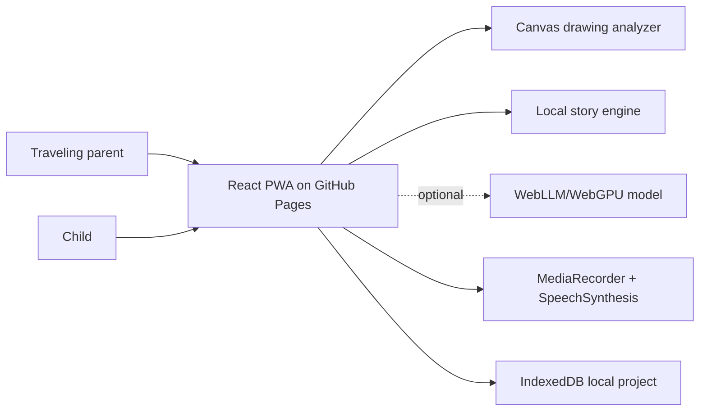

# Little Voice Stories


Live app: https://baditaflorin.github.io/little-voice-stories/

Repository: https://github.com/baditaflorin/little-voice-stories

Support: https://www.paypal.com/paypalme/florinbadita

Little Voice Stories turns a kid's drawing into a bedtime character, writes a cozy story locally,
and narrates it with a private parent voice profile for nights when work travel gets in the way.


## Quickstart

```bash
npm install
make dev
make test
make build
make pages-preview
```

## What V1 Does

- Digitizes a kid drawing in-browser with canvas color, edge, and coverage analysis.
- Turns the drawing into a named character seed with palette, mood, gift, and bedtime challenge.
- Generates a full bedtime story locally with a deterministic story engine.
- Offers an optional WebGPU/WebLLM local AI story path after explicit user action.
- Records around 30 seconds of parent audio and creates a local voice profile.
- Narrates the story with browser SpeechSynthesis tuned by the parent voice profile.
- Saves the current project in IndexedDB and works as an installable PWA.
- Shows version and commit in the live GitHub Pages UI.

V1 intentionally uses a privacy-preserving parent voice imprint instead of claiming exact neural
voice cloning. The app has no backend and no analytics.

## Architecture



Architecture docs: https://github.com/baditaflorin/little-voice-stories/blob/main/docs/architecture.md

ADRs: https://github.com/baditaflorin/little-voice-stories/tree/main/docs/adr

Deploy guide: https://github.com/baditaflorin/little-voice-stories/blob/main/docs/deploy.md

Privacy notes: https://github.com/baditaflorin/little-voice-stories/blob/main/docs/privacy.md

Postmortem: https://github.com/baditaflorin/little-voice-stories/blob/main/docs/postmortem.md

## Local Checks

```bash
make lint
make test
make build
make smoke
```

Install local hooks:

```bash
make install-hooks
```
