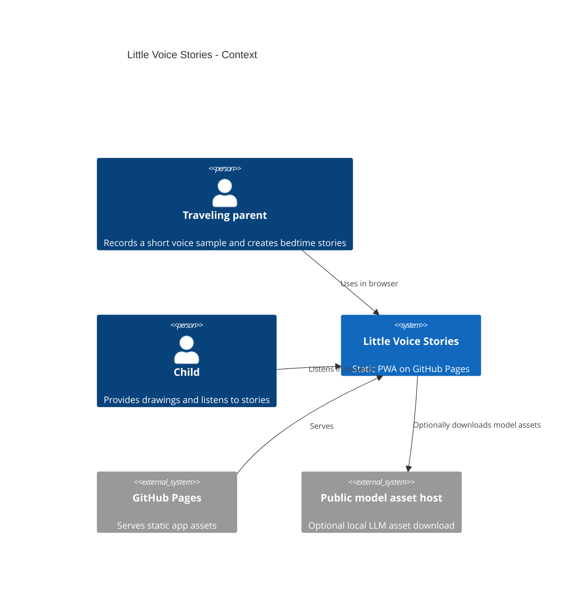
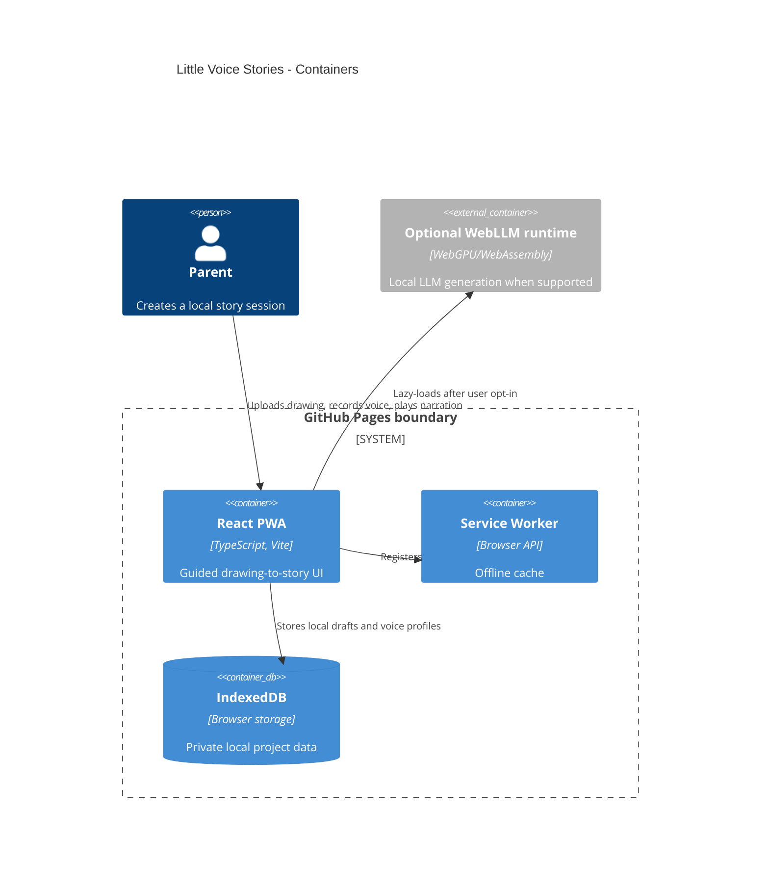

# Architecture

Live app: https://baditaflorin.github.io/little-voice-stories/

Repository: https://github.com/baditaflorin/little-voice-stories

## C4 Context

```mermaid
C4Context
  title Little Voice Stories - Context
  Person(parent, "Traveling parent", "Records a short voice sample and creates bedtime stories")
  Person(child, "Child", "Provides drawings and listens to stories")
  System(app, "Little Voice Stories", "Static PWA on GitHub Pages")
  System_Ext(github, "GitHub Pages", "Serves static app assets")
  System_Ext(modelHost, "Public model asset host", "Optional local LLM asset download")
  Rel(parent, app, "Uses in browser")
  Rel(child, app, "Listens in browser")
  Rel(github, app, "Serves")
  Rel(app, modelHost, "Optionally downloads model assets")
```

## Container Diagram

```mermaid
C4Container
  title Little Voice Stories - Containers
  Person(parent, "Parent", "Creates a local story session")
  System_Boundary(pages, "GitHub Pages boundary") {
    Container(staticApp, "React PWA", "TypeScript, Vite", "Guided drawing-to-story UI")
    Container(sw, "Service Worker", "Browser API", "Offline cache")
    ContainerDb(indexedDb, "IndexedDB", "Browser storage", "Private local project data")
  }
  Container_Ext(webLlm, "Optional WebLLM runtime", "WebGPU/WebAssembly", "Local LLM generation when supported")
  Rel(parent, staticApp, "Uploads drawing, records voice, plays narration")
  Rel(staticApp, indexedDb, "Stores local drafts and voice profiles")
  Rel(staticApp, sw, "Registers")
  Rel(staticApp, webLlm, "Lazy-loads after user opt-in")
```
